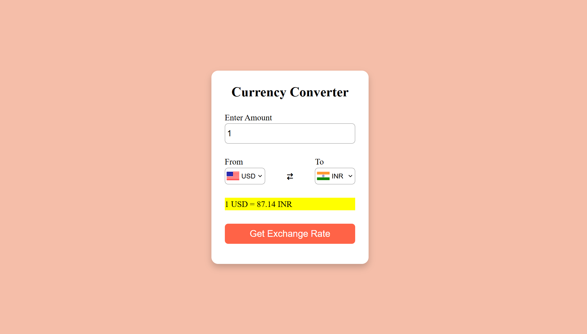

# Currency Converter

A simple and interactive web-based currency converter that allows users to convert amounts between different currencies using real-time exchange rates.




## Features

- **Real-time Exchange Rates**: Fetches the latest exchange rates from the [ExchangeRate-API](https://www.exchangerate-api.com/).
- **User-friendly Interface**: Intuitive design with dropdowns for selecting currencies and an input field for entering the amount.
- **Flag Icons**: Displays country flags corresponding to the selected currencies.
- **Swap Functionality**: Allows users to swap the "from" and "to" currencies with a single click.


## Technologies Used

- **HTML**: Structure of the web page.
- **CSS**: Styling and layout of the web page.
- **JavaScript**: Logic for fetching exchange rates, updating the UI, and handling user interactions.
- **ExchangeRate-API**: Provides real-time currency exchange rates.


## Setup Instructions

### Prerequisites

- A modern web browser (e.g., Chrome, Firefox, Safari).
- An API key from [ExchangeRate-API](https://www.exchangerate-api.com/).

### Steps

1. **Clone the repository**:
   ```bash
   git clone https://github.com/abhisheksinhagithub/Currency_Converter.git

2. **Navigate to the project directory**:
   ```bash
   cd Currency_Converter

3. **Get an API Key**:

   - Sign up at [ExchangeRate-API](https://www.exchangerate-api.com/) to get your free API key.
   - Replace the placeholder API key in the ```script.js``` file with your actual API key:
   
      ```bash
      const BASE_URL = "https://v6.exchangerate-api.com/v6/YOUR_API_KEY/pair"

4. **Open the Project**:
   - Open the ```index.html``` file in your web browser to view the currency converter.

5. **Usage**:
   - Enter the amount you want to convert.
   - Select the "from" and "to" currencies from the dropdown menus.
   - Click the "Get Exchange Rate" button to see the converted amount.
   - Use the exchange icon (↔️) to swap the "from" and "to" currencies.


## File Structure
```
Currency_Converter/
│
├── index.html          # Main HTML file
├── style.css           # CSS styles for the project
├── script.js           # JavaScript logic for the currency converter
├── codes.js            # Contains country codes and currency codes
├── Image/              # Directory for images (e.g., logo)
│   └── Logo.svg
└── README.md           # Project documentation
```


## API Reference

- ### ExchangeRate-API : https://www.exchangerate-api.com/docs
   - Endpoint: GET /v6/{api_key}/pair/{from_currency}/{to_currency}
   - Example: https://v6.exchangerate-api.com/v6/YOUR_API_KEY/pair/USD/INR


## License

This project is licensed under the MIT License. See the [LICENSE](LICENSE) file for details.


## Acknowledgments

- [ExchangeRate-API](https://www.exchangerate-api.com/) for providing the currency exchange data.
- [Font Awesome](https://fontawesome.com/) for the icons used in the project.
- [FlagsAPI](https://flagsapi.com/) for the country flag images.


## Contact

For any questions or feedback, feel free to reach out:

- Your Name: Your Email Address
- GitHub: your-username